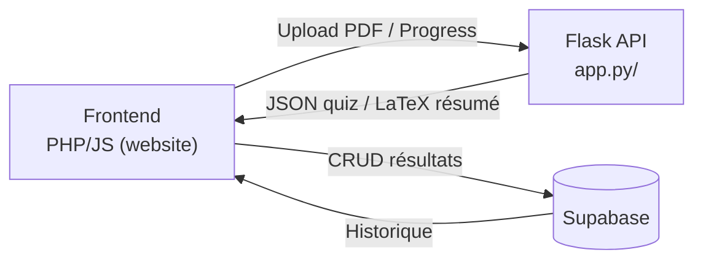

# IA_Projet_Groupe

## Présentation générale

**IA_Projet_Groupe** est une plateforme web qui permet :

1. d’uploader un ou plusieurs fichiers PDF ;
2. d’en extraire le texte ;
3. de générer automatiquement :
   - un **résumé LaTeX** propre (avec formules mathématiques intactes) ;
   - un **quiz interactif** corrigé et commenté ;
4. de consulter, télécharger (PDF) ou partager ces contenus ;
5. de conserver tous les résultats dans **Supabase** pour un accès ultérieur (Dashboard).

Le projet s’appuie principalement sur **Google Gemini 2.5 Flash** via LangChain, Flask côté backend et une interface PHP/JS moderne.

---

## Nouveautés majeures (mai 2025)

- 🔄 **Refonte du backend** : le dossier `basic_2/` est devenu `app_py/` ; architecture plus claire, routes Flask découplées, traitement asynchrone via threads.
- ⏳ **Traitement asynchrone & suivi de progression** : l’upload renvoie un `task_id` ; le frontend interroge `/result/<task_id>` pour connaître l’avancement (message + barre % + aperçu).
- 🗄️ **Stockage Supabase** : tous les quiz/résumés sont désormais automatiquement enregistrés (PHP `save_result.php`) ; consultation via le Dashboard.
- 📄 **Génération PDF serveur** : deux nouvelles routes Flask :
  - `POST /latex_to_pdf` (résumés LaTeX ➜ PDF)
  - `POST /json_quiz_to_pdf` (quiz JSON ➜ PDF)
  Les PDF sont servis depuis `/download/<file>.pdf`.
- 🖥️ **Interface multi-cours** : onglet « Quiz », « Résumé », ou les deux + sélecteur de cours lorsque plusieurs résultats sont chargés.
- 🧮 **Rendu MathJax dynamique** + conversion LaTeX ➜ HTML pour l’aperçu résumé.
- 🗂️ **install_requirements.py** : installation automatique des dépendances Python manquantes lors du premier lancement.
- 🧹 Nettoyage du code, suppression de `Prompt.txt` (prompts intégrés dans `gemini_incl.py`).

---

## Architecture technique



---

## Organisation du dépôt

```
IA_Projet_Groupe/
│
├── app_py/                 # Backend Flask & IA
│   ├── app.py              # Routes API, gestion tâches, download PDF
│   ├── classes.py          # Modèles Source / Result (extraction PDF)
│   ├── gemini_incl.py      # Wrapper LangChain + prompts Gemini
│   ├── result_prep.py      # Post-traitement (LaTeX, JSON ➜ LaTeX, PDF)
│   ├── install_requirements.py # Installateur automatique
│   ├── requirements.txt    # Dépendances Python
│   ├── uploads/            # PDF uploadés (temporaire)
│   ├── download/           # PDF générés (résumé / quiz)
│   └── ex.json             # Exemple de quiz
│
├── website/                # Frontend
│   ├── *.php               # Pages dynamiques (upload, quizz, dashboard…)
│   ├── assets/
│   │   ├── css/styles.css  # Styles Bootstrap-like + custom
│   │   └── js/script.js    # Logique quiz, sélecteur cours, appels API
│   └── header.html & footer.html
│
├── config_example.env       # Modèle de fichier .env (Supabase & Flask URL)
└── Readme.md                # Vous y êtes 👋
```

---

## Détail des fichiers clés

| Chemin | Rôle principal |
|--------|----------------|
| **app_py/app.py** | Point d’entrée Flask : upload, suivi de tâche, génération PDF |
| **app_py/gemini_incl.py** | Classe `AI` : appels Gemini + prompts français/anglais |
| **app_py/result_prep.py** | Nettoyage JSON quiz ➜ LaTeX, compilation LaTeX ➜ PDF |
| **website/quizz.php** | Interface quiz/résumé + loader + onglets + export PDF |
| **website/assets/js/script.js** | Construction UI quiz, appels `/json_quiz_to_pdf` & `/latex_to_pdf` |
| **website/save_result.php** | Envoi des résultats à Supabase |
| **app_py/install_requirements.py** | Script de fallback pour installer les packages manquants |

---

## Installation

### 1. Cloner le dépôt
```bash
git clone https://github.com/votre_org/IA_Projet_Groupe.git
cd IA_Projet_Groupe
```

### 2. Backend Python
```bash
cd app_py
python -m venv .venv
source .venv/bin/activate  # PowerShell : .venv\Scripts\Activate
python install_requirements.py  # installe automatiquement requirements.txt
python app.py               # démarre le serveur sur http://127.0.0.1:5000
```

> Le script crée automatiquement `uploads/` et `download/` si nécessaire.

### 3. Frontend PHP

1. Copier `config_example.env` en `.env` **à la racine** puis renseigner :
   - `SUPABASE_URL`, `SUPABASE_KEY`, `SUPABASE_TABLE`
   - `FLASK_URL` (ex. `http://127.0.0.1:5000`)
2. Placer le dossier `website/` dans votre virtual-host (WAMP/XAMPP). Exemple :
   - `http://localhost/IA_Projet_Groupe/website/index.php`

> Les pages vérifient automatiquement la présence d’un token OAuth Google (voir `login.php`).

### 4. Dépendances JS (CDN)
- MathJax 3.2.2
- jsPDF 2.5.1 (+ html2canvas)

Elles sont chargées via CDN, aucun build Node n’est requis.

---

## Flux de travail

1. L’utilisateur uploade un ou plusieurs PDF depuis `index.php` et choisit :
   - **1** ➜ générer Résumé uniquement
   - **2** ➜ générer Quiz uniquement
   - **3** ➜ Résumé puis Quiz
   - **4** ➜ Résumé uniquement
2. `index.php` envoie le form-data à `app_py/app.py` :`POST /`.
3. Flask crée une **tâche asynchrone** (`task_id`) et renvoie immédiatement JSON :`{"task_id": "…"}`.
4. Le frontend bascule sur `quizz.php` qui :
   - affiche un loader
   - interroge périodiquement `/result/<task_id>`
   - met à jour la barre de progression + aperçu (`preview`).
5. Lorsque le statut passe à `completed`, le résultat (liste de chaînes) est reçu ; `script.js` :
   - nettoie le JSON / LaTeX
   - construit l’interface Quiz & Résumé
6. Les boutons « Télécharger PDF » déclenchent les appels aux routes `/json_quiz_to_pdf` ou `/latex_to_pdf` qui retournent l’URL du PDF compilé.
7. `save_result.php` sauvegarde automatiquement le contenu dans Supabase afin d’être listé dans `dashboard.php`.

---

## Dépannage

| Problème | Piste de résolution |
|----------|--------------------|
| **Aucune progression** | Vérifier que `app.py` tourne bien et que le port est accessible (FLASK_URL). |
| **Erreur “Aucun LaTeX fourni”** | S’assurer que le LaTeX est correctement encapsulé dans `\begin{document}…\end{document}`. |
| **PDF vide / syntax error** | Installer `pdflatex` (TeX Live) et s’assurer qu’il est dans le PATH. |
| **401 Supabase** | Mauvaise `SUPABASE_KEY` ou RLS actif sur la table. |
| **JSON parse error** | Le prompt Gemini a parfois des échappements \ → vérifier `gemini_incl.clean_json`. |

---

## Roadmap

- Passer le traitement asynchrone à Celery + Redis (pour décharger le serveur Flask).
- Authentification OAuth entièrement côté Supabase Auth.
- Interface React moderne (remplacer PHP) + build Vite.
- Fine-tuning Mistral-7B local pour réduire la dépendance API.

---

## Auteurs & Licence

- Projet réalisé par **IA_Projet_Groupe** (DP · FA · GT)
- Encadré par *Nom de l’enseignant*
- Licence **MIT**
